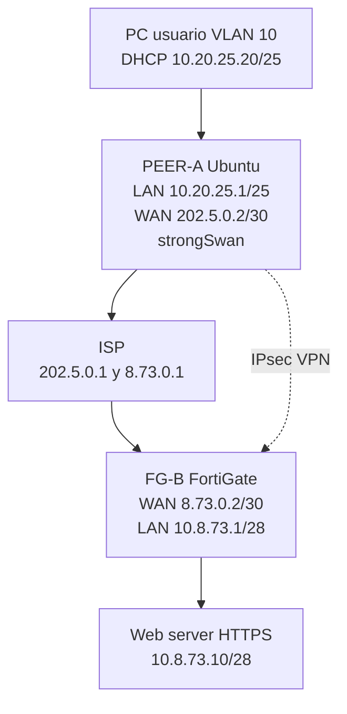
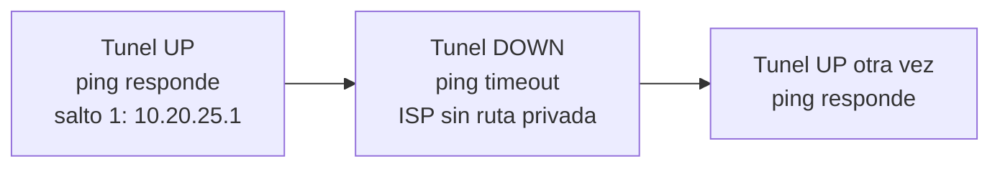

# Infraestructura 2: VPN site-to-site entre FortiGate y un equipo de red

## Video

https://youtu.be/SxBwcR60QdM

Matricula: **2025-0873**

## Diagrama

Diagrama descargable: [diagramas/topologia.svg](diagramas/topologia.svg)

## Objetivo

Comunicar el usuario con el servidor web a traves del enlace VPN y comprobar que esa comunicacion solo fluye si el tunel esta activo.

En esta infraestructura solo hay un FortiGate. El otro extremo es Ubuntu con strongSwan, porque GNS3 no tenia un router Cisco.

## Direccionamiento

| Equipo | Interfaz | IP |
|---|---|---|
| ISP | ens3 | 202.5.0.1/30 |
| PEER-A | ens3 WAN | 202.5.0.2/30 |
| ISP | ens4 | 8.73.0.1/30 |
| FG-B | port1 WAN | 8.73.0.2/30 |
| PEER-A | ens4 LAN | 10.20.25.1/25 |
| PC-User | e0 | DHCP 10.20.25.20-100/25 |
| FG-B | port2 LAN | 10.8.73.1/28 |
| WEB-SRV | ens3 | 10.8.73.10/28 |

Trafico interesante: `10.20.25.0/25` hacia `10.8.73.0/28`.

